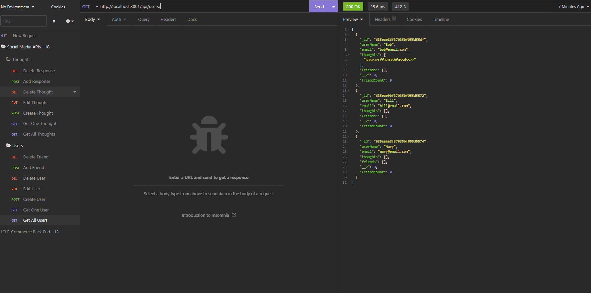
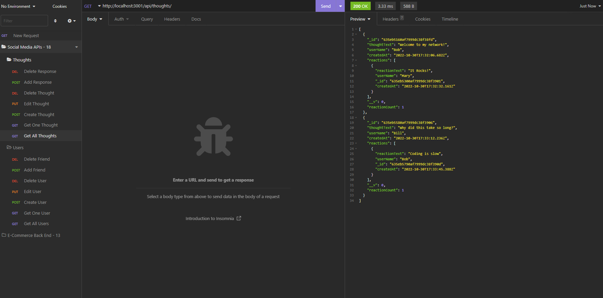

# NoSQL Social Network API's

## Table of Contents:
- [Description](#description)
- [Installation](#installation)
- [Usage](#usage)
- [Examples](#examples)
- [Links](#links)

## Description
This app creates the backend API routes necessary for a social network site. Using insomnia to test the routes, user's can create a new profile, add thoughts, and react to others's thoughts. User's can also add other users as friends.

## Installation
Requirements
- Express
- MongoDB
- Mongoose

## Usage
1. Clone repository from Github
2. Run "npm i" to install necessary node modules
3. Run "npm start" to start the server
4. Test routes using Insomnia or equivalent program
5. There is no seed file included so all entries in the DB will need to be added through Insomnia

## Examples
Using Insomnia all API routes can be tested to populate the database.

## Links
-[Github](https://github.com/heintze11/social-network-api)

-[Video Walkthrough](https://drive.google.com/file/d/1Y5Ypo2rvNXJWDT7V6ycYUspo81ZjxhgT/view)
